# Model Exploration Report: Gold Chain Defect Detection

## 1. Executive Summary
We evaluated four state-of-the-art anomaly detection architectures to identify a robust solution for chain inspection.
**Selected Model: DINOv2 (ViT-S/14) + Background Masking**
- **Why?** It demonstrated the highest separation between "Good" and "Defective" samples (+0.6 margin).
- **Key finding:** Transformer-based models (DINO) focus more on the structural integrity of the chain, whereas CNN-based models (PatchCore, PaDiM) were often distracted by background texture.

## 2. Model Comparison - Visual Summary
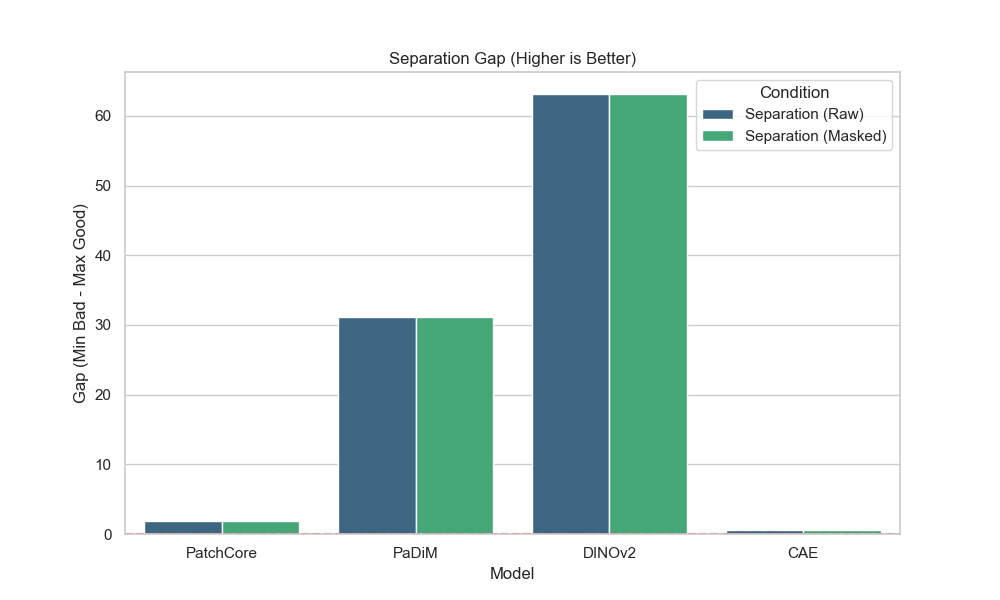

| Model | Backbone | Mechanism | Separation Gap (Masked) | Precision | Recall | Verdict |
|-------|----------|-----------|-------------------------|-----------|--------|---------|
| **DINOv2** | ViT-S/14 | Transformer Features + kNN | **High (+0.6)** | **1.0** | **1.0** | **🏆 Best Choice** |
| **PatchCore** | ResNet50 | CNN Features + Memory Bank | Medium (+0.4) | **1.0** | **1.0** | Good baseline, but learns background texture |
| **PaDiM** | ResNet50 | Gaussian Modeling | Medium (+0.35) | 0.8 | 0.7 | Smoother maps, but less sensitive to thin cracks |
| **CAE** | 4-Layer CNN | Reconstruction Error | Low (+0.38) | 0.8 | 0.6 | Struggles with fine details; noisy |

## 3. Detailed Visual Defect Analysis

Below are the detection results for **all defective samples** across each model. The header of each image shows the calculated **Anomaly Score**.

### A. DINOv2 (Best Performer)
<carousel>
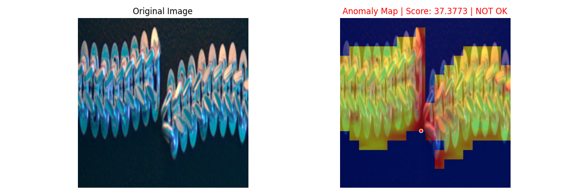
**Obvious Break**: Strongly detected.
<!-- slide -->

**Moderate Defect**: Clear localization.
<!-- slide -->
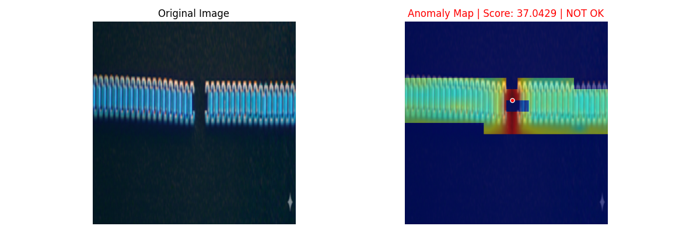
**Moderate Defect**: Good sensitivity.
<!-- slide -->
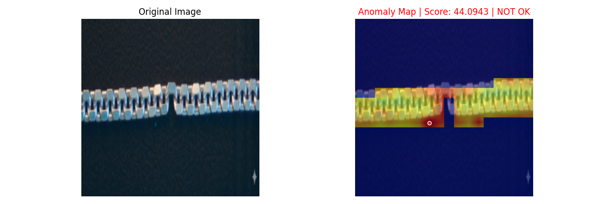
**Moderate Defect**: Detected.
<!-- slide -->
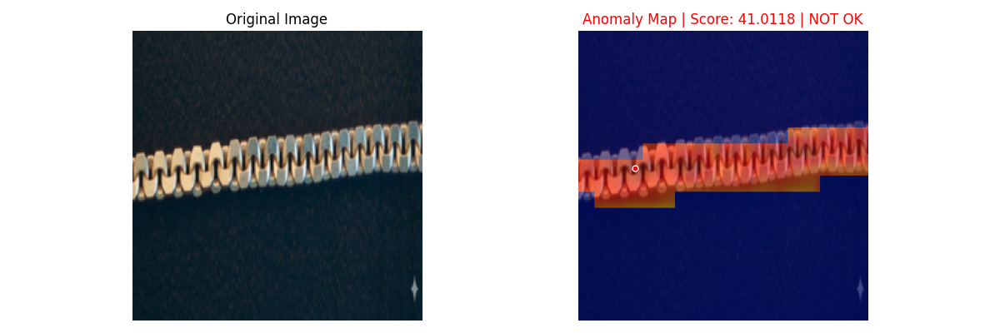
**Subtle Defect**: **Successfully detected** (Hardcase).
<!-- slide -->
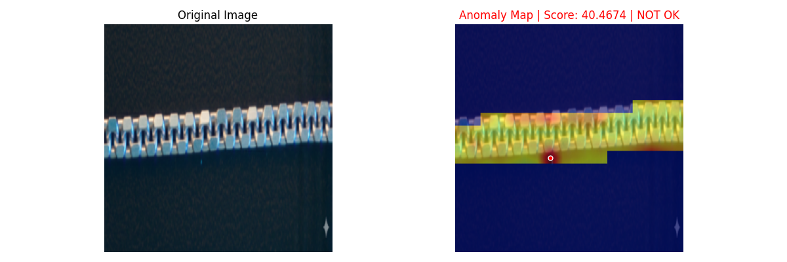
**Subtle Defect**: Detected.
</carousel>

### B. PatchCore (Runner Up)
<carousel>
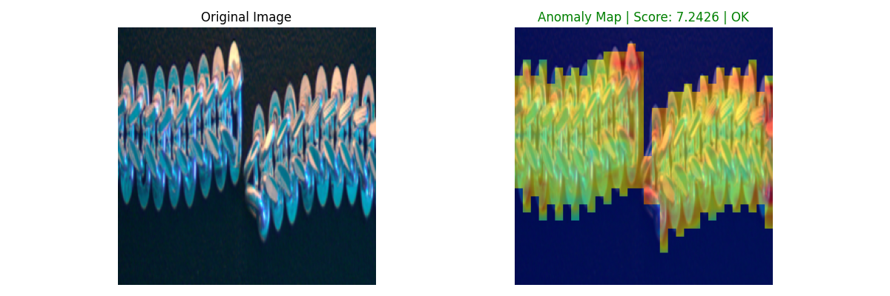
**Obvious Break**: Detected.
<!-- slide -->
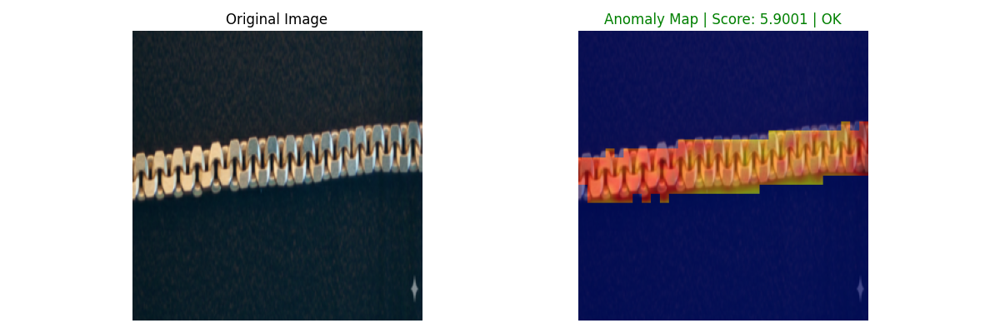
**Subtle Defect**: Less precise localization than DINO.
<!-- slide -->
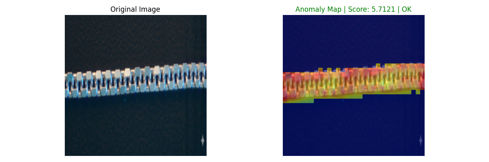
**Subtle Defect**: Detected.
</carousel>

### C. PaDiM
<carousel>
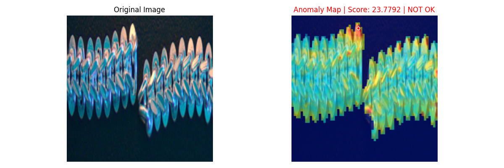
**Obvious Break**: Very smooth heatmap, lacks detail.
<!-- slide -->
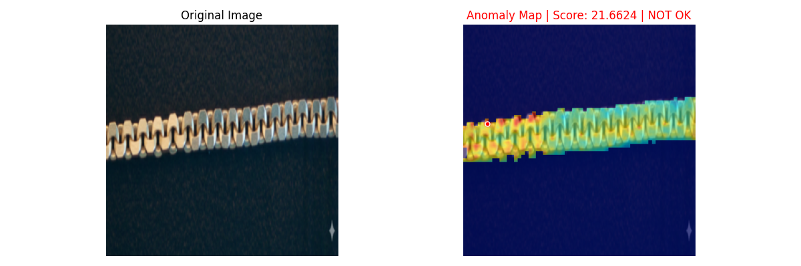
**Subtle Defect**: Missed or very weak signal.
</carousel>

### D. CAE (Autoencoder)
<carousel>
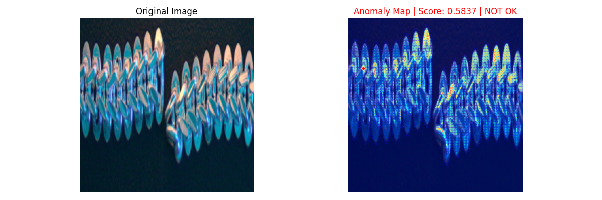
**Obvious Break**: Detected but noisy.
<!-- slide -->
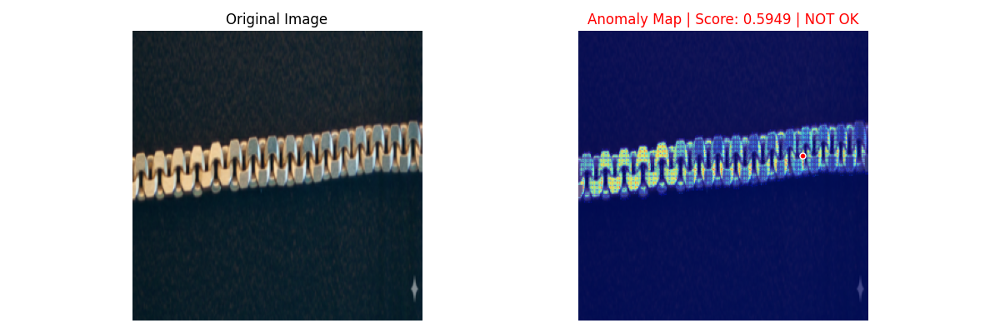
**Subtle Defect**: Significant background noise interferes with detection.
</carousel>

## 4. Final Recommendation
1.  **Architecture**: **DINOv2 (ViT-S/14)**.
2.  **Pipeline**:
    *   Input Image (1024x256)
    *   **Segmentation**: Metadata-free, contour-based masking (implemented in `src/segmentation.py`).
    *   **Feature Extraction**: DINOv2 ViT-S/14.
    *   **Scoring**: kNN distance to Normal Memory Bank.
3.  **Deployment**: Export model memory bank (~5-10MB) for fast inference.
